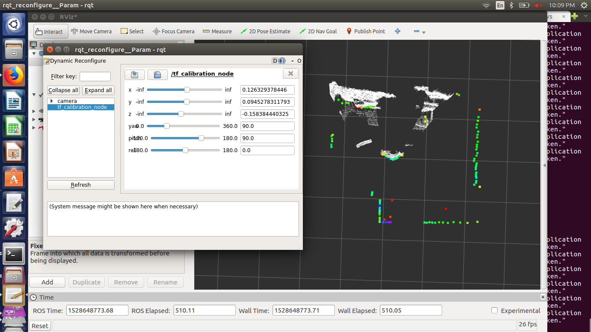

This node can be used for tf calibration of LiDAR-Kinect Camera,
no algorithm is used. It's just taking advantage of the dynamic reconfigure
package in ROS. 

1) launch the node, the child and parent frame can be provided, by default child frame is 'laser' and parent frame is
'camera_rgb_frame'.

2) Open Rviz and visualize the change that occurs while changing the values in the reconfigure_gui.

